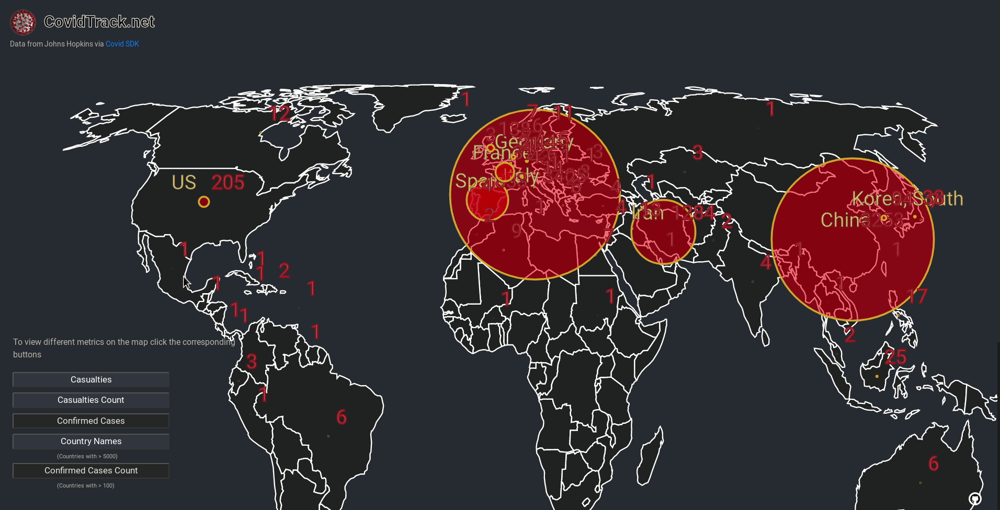

---------------------------------------------------
## covidtrack.net


View the live maps:

https://covidtrack.net

Tooltip Demos:


React-Maps Flask-Covid:

Plot live Covid19 Data from both the John Hopkins Covid API and the covidtracking.com API on SVG world map, and a U.S. map of all affected States

A minimal app for viewing the latest Corona Virus data

Quick summary:

World Map:
- The back end API ( Python flask ) reports back the latest Covid19 data as according to Johns Hopkins, using https://pypi.org/project/covid/ including long/lat locations of affected countries

United States Map:
- A second API is used for getting United States Covid19 data from covidtrack.ing.com

- The front end SVGs map ( React ) displays the covid data mapped to geolocation 
- Buttons are used to add/ remove additional data from the map

- React Middleware Proxy is used to connect the front/ back end

- Added tests and linting for both front/back ends

## Starting the app in docker-compose:

The easiest way to start the app (requires docker-compose) is to run:

'docker-compose up'

and go to localhost:3000 to view the application

This will start both the front and backend containers

NOTE: if you don't have docker-compose available use the instructions below

-----------------------------------------------------

## Starting the app on the host machine:

Both the front end and back end support hot reloading/ live reloading during development.

Running the front end (react) and back end (flask api) outside of docker may be easier during development to avoid rebuilding containers when testing changes.

To develop and run this app outside of docker a proxy is needed to allow requests from localhost:3000(frontend) to localhost:5000(backend):

Change the proxy in client/src/setupProxy.js from:

  target: 'http://api/', (docker network alias)

  to

  target: 'http://localhost:5000/'

This will allow the proxy to work on the host machine as opposed to within the docker network.

This setup will require you to start the react front end and flask back end individually. To do this:

Start the front end:
```
  cd client && yarn start
```

Start the back end in another terminal:
```
cd api && FLASK_APP=app/app.py FLASK_ENV=development flask run
```
(FLASK_ENV=development is optional)


Docker-compose also installs the front/backend dependencies, to do this on the host machine:

Install front end dependencies:
```
sudo apt install npm nodejs -y
sudo npm cache clean -f
sudo npm install -g n

upgrade npm
sudo npm install npm@latest -g
```

Enter client directory and install node_modules
```
cd client
npm install
```

Install back end dependencies:
```
sudo apt install python3 python3-pip python3-venv -y

cd api
```
Activate a virtual environment for installing dependencies
```
python3 -m venv venv
source venv/bin/activate
pip3 install -r requirements.txt
```
Run the API

```
FLASK_ENV=development FLASK_APP=app/app.py flask run
```

----------------------------------------------------------------
## Testing

To test the front end
```
cd client
npm  test (then press a to run all tests)
```

To test the back end
```
cd api/app && python test.py -v
```

Below are some additional commands taken from create-app README

This project was bootstrapped with [Create React App](https://github.com/facebook/create-react-app).

Available Scripts

In the client/ directory, you can run:

`npm start`

Runs the app in the development mode.<br />
Open [http://localhost:3000](http://localhost:3000) to view it in the browser.

The page will reload if you make edits.<br />
You will also see any lint errors in the console.

`npm  test (then press a to run all tests)`

Launches the test runner in the interactive watch mode.<br />
See the section about [running tests](https://facebook.github.io/create-react-app/docs/running-tests) for more information.

`npm build`

Builds the app for production to the `build` folder.<br />
It correctly bundles React in production mode and optimizes the build for the best performance.

The build is minified and the filenames include the hashes.<br />
Your app is ready to be deployed!

See the section about [deployment](https://facebook.github.io/create-react-app/docs/deployment) for more information.
